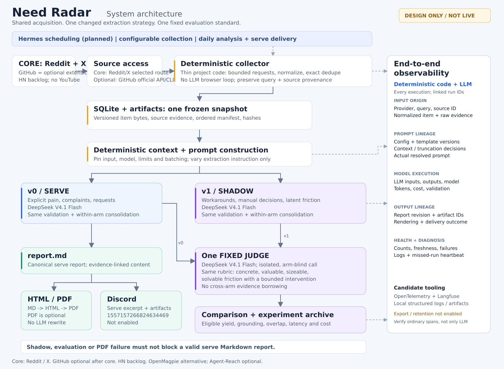
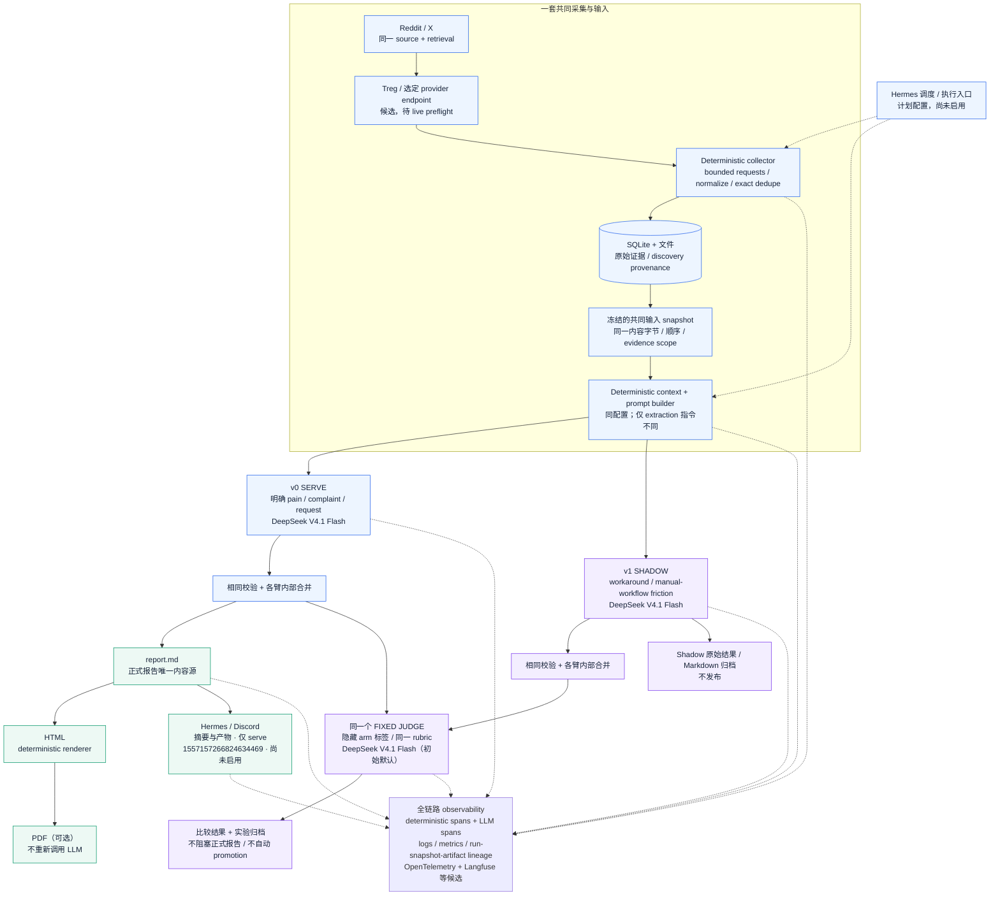

# Need Radar：整体架构图

更新：2026-10-06。**这是待实现的设计，不表示服务已经部署、接口已经实测或 Discord 已启用。**

[浏览器查看版](architecture.html) · [可缩放 SVG](diagrams/system-overview.svg) · [完整设计](design.md) · [模型与频道](runtime-selections.md)

## 怎么读这张图

**上半部只有一套采集。** Reddit/X 经选定的 Treg provider endpoint 进入薄采集程序。程序执行有边界的请求、规范化、exact dedupe，保存原始证据与发现来源，再冻结当天的共同输入。Treg 是优先核查的候选，不是已经验证可用的服务。它不代替本地状态、实验规则或应用内 tracing。

**中间只改变 extraction。** 同一个 deterministic context builder 给 v0 和 v1 提供相同帖子、评论范围、排序、batch 和资源上限。v0 找明确抱怨/请求；v1 找 workaround/重复操作背后的真实负担。两边都用用户选定的 DeepSeek V4.1 Flash；正式 endpoint/provider 仍待接入检查。

**下面是两条独立分支。** v0 的有效结果生成唯一内容源 `report.md`，之后 deterministic 地投影成 HTML、可选 PDF 和 Discord 内容。另一条分支把两边候选送给同一个固定 judge，保留比较结果，但不对用户发送第二份日报。judge、shadow 或可选 PDF 失败，不拖垮有效的 Markdown 报告。

**右侧贯穿程序本身和 LLM。** 不是只看模型调用：从报告可以追到 actual prompt、模板、配置、context assembly、截断决策、normalized items、原始 evidence 和 query/provider。各个执行有自己的 trace，通过 run/snapshot/artifact IDs 关联；不是强行做一个跨天长 trace。图中虚线代表控制/诊断关联，不是报告的前置依赖；为避免连线拥挤，仅画了部分 telemetry 关联。

## 复用与自建边界

| 模块 | 分工 |
|---|---|
| Hermes | 复用定时触发、模型执行入口及 Discord 连接；真实运行细节待核查，不重写网关 |
| Treg | 复用选定外部数据接口的访问路径；不承担本地 polling 历史或实验管理 |
| 薄采集程序 + SQLite/文件 | 我们的少量 deterministic glue：请求边界、去重、快照和 provenance |
| Extraction + fixed judge | 我们定义两版 prompt、统一 schema、评测标准及配置；调用模型而非另建 agent framework |
| 报告 | 同一份 Markdown；复用 renderer，Quarto/Chromium 尚待 fixture 验证 |
| Observability | 自己补业务关键 span/输入输出关联；复用 OpenTelemetry/Langfuse 等候选基础设施，不重建观测平台 |

OpenMagpie 是可替代采集子系统，不与 Treg 路径同时强制部署。Agent-Reach 是后续可能的 enrichment/fallback；GitHub/HN 是后续 source，不把它们变成第一版的前置条件。

## 已记录的具体配置

- 模型：**DeepSeek V4.1 Flash**。官方 API 当前名称：`deepseek-flash`；这不表示用户的 provider/key 已配置。
- 初始 judge 也先复用所选模型，是减少依赖的可逆默认值；独立调用、固定 rubric、隐藏来源 arm，不共享 extractor 会话。同模型 judge 不是独立真值。
- Discord：**`1557157266824634469`**，作为字符串保存。频道已指定，尚未发送或启用定时任务。
- 账号、token、预算和权限在首次相应 live preflight 前核查。无需为了看架构先交密钥。

## 可编辑 Mermaid 源码

以下源码与上面的 SVG 表达同一逻辑。更新设计时同时更新图与源码；SVG 是已排版的静态文档附件，不是新增应用前端。

## 诊断路径例子（不是新模块）

发现报告内容不对时，按 `report_id → serve_run_id → actual_prompt → context_manifest → ordered_item_versions → acquisition_run/query/provider` 追查。每一步关联对应配置/代码版本及输入输出，不用根据模型看到的错误 prompt 猜上游发生了什么。

完整约束以 [design.md](design.md) 为准；凭证时机和官方来源见 [runtime-selections.md](runtime-selections.md)。原 Hermes 问答 [qa-transcript.md](grill/qa-transcript.md) 保留历史原文，本次没有重写或伪造新的问答。
